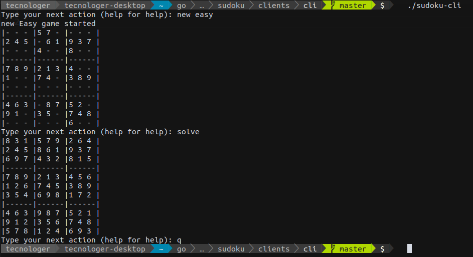

# Sudoku CLI

Sudoku game with CLI

## How to play?

1. `sudoku-cli`
2. `new <level>`
     level one of:
   - Easy
   - Basic
   - Medium
   - Hard
   - Master
3. `set <x,y,v>`
   - `x,y` are the coordinates between 1 and 9
   - `v` is the value to set in the coordinate, between 1 and 9
4. repeats step 3 until all board is completed
5. then type `validate` and check if the solution is correct

## Screenshots

